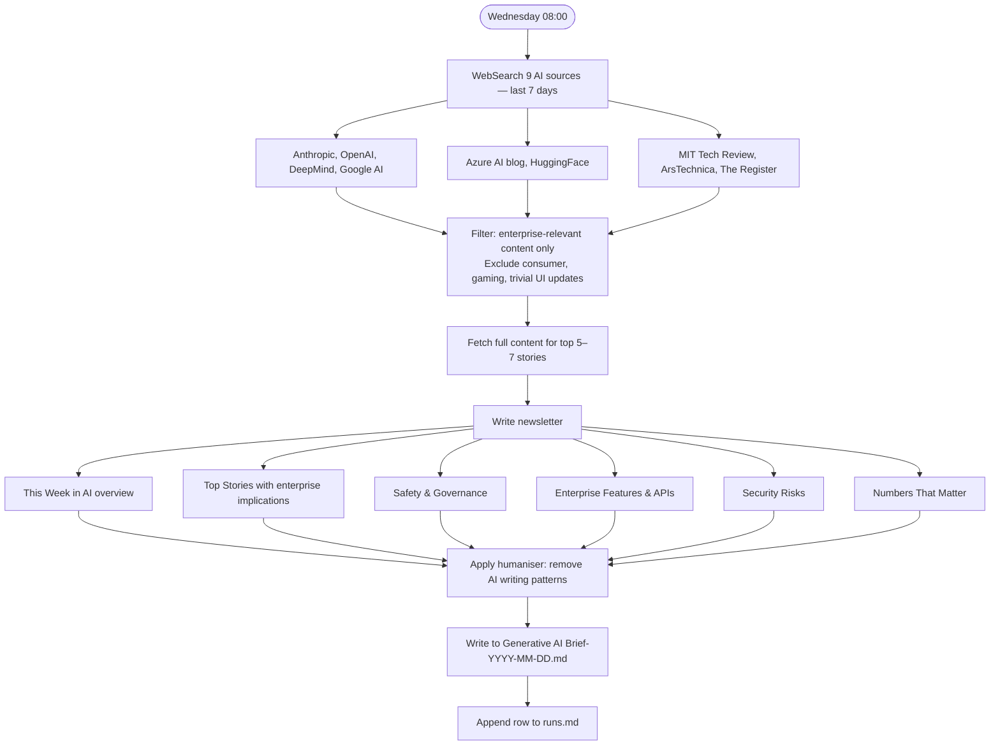

# Generative AI Brief

**Cadence:** Weekly — every Wednesday at 08:00 Stockholm  
**Cron:** `0 6 * * 3` (06:00 UTC)  
**Output:** `Generative AI Brief-YYYY-MM-DD.md`  
**Status:** Active — remote routine

## Description

Weekly newsletter covering enterprise-relevant generative AI developments from the past 7 days. Searches nine AI sources, filters for enterprise relevance, fetches full content for the top 5–7 stories, and writes a structured newsletter with humanised prose.

## Sections

- This Week in AI (overview)
- Top Stories with enterprise implications
- Safety & Governance
- Enterprise Features & APIs
- Security Risks
- Numbers That Matter

## Sources

Anthropic, OpenAI, DeepMind, Google AI, Azure AI blog, HuggingFace, MIT Tech Review, Ars Technica, The Register

## Process

## Prompt

> Prompt not yet written. See diagram for process description.
