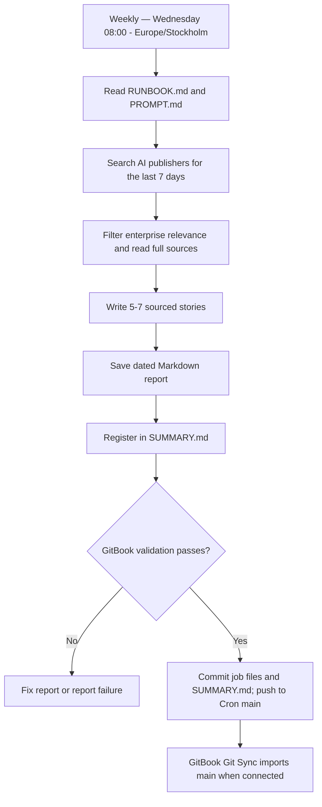

---
layout:
  width: wide
---

# Generative AI Brief

Enterprise-relevanta AI-nyheter från de senaste sju dagarna.

**Codex-jobb:** `Cron - Generative AI Brief`  
**Modell:** Luna 6.0 (`gpt-6-luna`), medium reasoning  
**Schema:** Weekly — Wednesday 08:00, `Europe/Stockholm`  
**Rapport:** `Generative AI Brief-YYYY-MM-DD.md`

- [Prompt](PROMPT.md)
- [Exempel](EXAMPLES.md)
- [Gemensamma körinstruktioner](../RUNBOOK.md)
- [Mermaid-källfil](diagram.mmd)

## Process

```mermaid
flowchart TD
    A["Weekly — Wednesday 08:00 - Europe/Stockholm"] --> B["Read RUNBOOK.md and PROMPT.md"]
    B --> C["Search AI publishers for the last 7 days"]
    C --> D["Filter enterprise relevance and read full sources"]
    D --> E["Write 5-7 sourced stories"]
    E --> F["Save dated Markdown report"]
    F --> G["Register in SUMMARY.md"]
    G --> H{"GitBook validation passes?"}
    H -- No --> I["Fix report or report failure"]
    H -- Yes --> J["Commit job files and SUMMARY.md; push to Cron main"]
    J --> K["GitBook Git Sync imports main when connected"]
```
