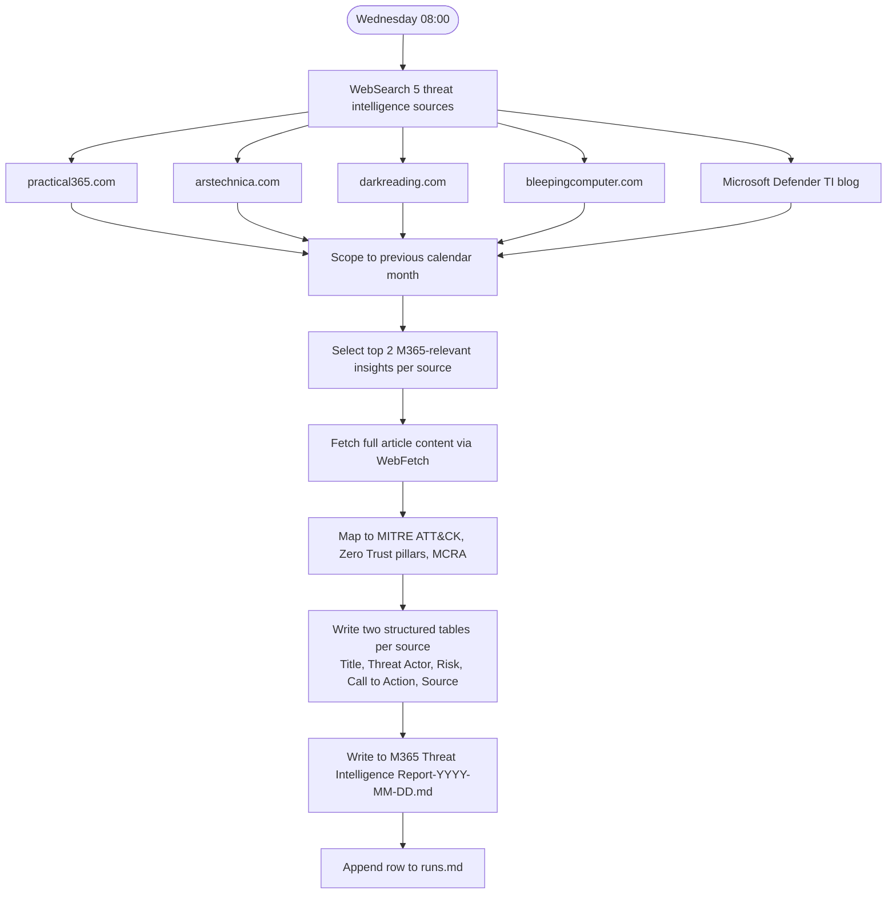

# M365 Threat Intelligence Report

**Cadence:** Monthly — 1st of month at 08:00 Stockholm  
**Cron:** `0 6 1 * *` (06:00 UTC)  
**Output:** `M365 Threat Intelligence Report-YYYY-MM-DD.md`  
**Status:** Active — remote routine

## Description

Monthly threat intelligence report for Microsoft 365 environments, authored from the perspective of a senior threat intelligence analyst. Pulls two M365-relevant insights per source from five threat intelligence outlets, maps each to MITRE ATT&CK techniques, Zero Trust pillars, and MCRA components, and delivers structured tables with call-to-action guidance for security architects and SOC leads.

## Sources

The Hacker News, Ars Technica (security), Dark Reading, BleepingComputer, Microsoft Threat Intelligence blog

## Process

## Prompt

Act as a senior Threat Intelligence Analyst specializing in Microsoft 365, Entra ID, and the broader Microsoft cloud stack. Audience: security architects, SOC leads, and cyber leadership.

Objective: From the content sources listed below, identify important threat intelligence insights relevant to Microsoft 365 environments and closely related Microsoft cloud threats (Entra ID, Azure, Defender, etc.). For each source: (1) search the site for recent, relevant threat intelligence; (2) apply the Date & Time Scoping rules below; (3) select the two most relevant insights that involve Microsoft 365, Entra ID, Azure, or SaaS ecosystems commonly integrated with M365, OR highlight notable identity, email, SaaS, or cloud attack paths directly applicable to M365 estates; (4) summarize two insights per source using the markdown table template defined below.

### Date & Time Scoping

1. Use the actual current date at the time of running.
2. Target month = the previous calendar month relative to the current date (e.g., if today is in March 2026, target = February 2026).
3. Content selection rules: First try to select insights published in the target month. If two suitable insights cannot be found in the target month, extend the search window slightly backward (1–2 additional months), preferring insights closest in time. If outside the target month, still include if highly relevant, framed as currently useful for M365 defenders. Every source must produce two insights — fall back to older content if needed and label it as a fallback.

### Output Requirements

- Structure the answer by source, using a heading per source that links to the source's main page, e.g. `#### Source: [The Hacker News](https://thehackernews.com/)`.
- Under each source, create two separate tables (Insight 1, Insight 2) using the template below.
- In the **Title** field of each table, format the title as a markdown hyperlink to the actual article URL. The URL must be one you actually fetched — never invented.
- Use concise, high-signal language for security architects and SOC leads (not end-user training).
- Where relevant, explicitly mention MITRE ATT&CK techniques, campaign names, and named threat actors (APT groups, "Storm-XXXX", PhaaS brands).
- In Strategic Initiative, explicitly tie back to Microsoft Cybersecurity Reference Architecture (MCRA) components (Identity, Threat Protection, SIEM+XDR, Data Protection, SecOps) and Zero Trust pillars (Identity, Device, Application, Data, Network, Visibility & Analytics).

### Output Template

Use this exact markdown table for each insight:

| Field | Description |
|-------|-------------|
| **Title** | [Article Title](https://actual-article-url) — hyperlinked to the actual article |
| **Introduction** | Short 1–3 sentence summary in clear, practical language |
| **Status** | One of: Stay informed / Assess / Educate |
| **Threat Actor including TTPs, Targets & Region** | Actor/campaign name (if known), key TTPs, primary targets, regions |
| **Affected Cybersecurity Domain** | e.g. Identity & Access / Email Security / Endpoint / Vulnerability Management / Ransomware / Social Engineering / Phishing / Generative AI / SaaS / Cloud Infrastructure / BEC |
| **Risk** | Concrete risks for M365 (tenant takeover, BEC, lateral movement, data exfiltration, privilege escalation, SaaS/HR system abuse, service disruption) |
| **Strategic Initiative** | Strategic changes aligned with MCRA and Zero Trust |
| **Call to Action** | Prioritized actions (technical controls, monitoring/hunting, detection engineering, awareness/training, policy/process changes) |
| **Source** | [source-main-page-name](https://source-main-page-url) — hyperlinked to the source's main page |

### Content Sources

External threat intel:
1. The Hacker News — https://thehackernews.com/
2. Ars Technica (security) — https://arstechnica.com/
3. Dark Reading — https://www.darkreading.com/
4. BleepingComputer — https://bleepingcomputer.com/
5. Microsoft Threat Intelligence — https://www.microsoft.com/en-us/security/blog/topic/threat-intelligence/

Every source must produce 2 insights. Prioritize: cloud identity abuse (token theft, session hijacking, OAuth/device code abuse, password spray); Phishing/BEC and PhaaS targeting M365; AiTM against M365/Entra ID; cookie theft/session hijacking; abuse of M365/Entra ID features; SaaS compromise integrated with M365; Defender XDR / Sentinel-relevant behaviors.

Final answer: 5 sources × 2 insights = 10 insight tables, plus an executive summary. All sources as direct links.

### Output file

Save the report as `M365 Threat Intelligence Report-YYYY-MM-DD.md` where the date is today's run date.
