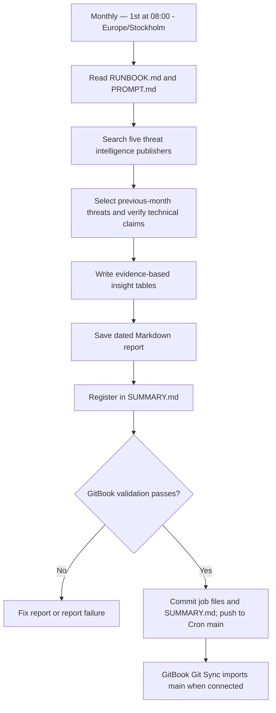

---
layout:
  width: wide
---

# M365 Threat Intelligence Report

Hot mot Microsoft 365, Entra ID och närliggande molntjänster.

**Codex-jobb:** `Cron - M365 Threat Intelligence Report`  
**Modell:** Luna 6.0 (`gpt-6-luna`), medium reasoning  
**Schema:** Monthly — 1st at 08:00, `Europe/Stockholm`  
**Rapport:** `M365 Threat Intelligence Report-YYYY-MM-DD.md`

- [Prompt](PROMPT.md)
- [Exempel](EXAMPLES.md)
- [Gemensamma körinstruktioner](../RUNBOOK.md)
- [Mermaid-källfil](diagram.mmd)

## Process

```mermaid
flowchart TD
    A["Monthly — 1st at 08:00 - Europe/Stockholm"] --> B["Read RUNBOOK.md and PROMPT.md"]
    B --> C["Search five threat intelligence publishers"]
    C --> D["Select previous-month threats and verify technical claims"]
    D --> E["Write evidence-based insight tables"]
    E --> F["Save dated Markdown report"]
    F --> G["Register in SUMMARY.md"]
    G --> H{"GitBook validation passes?"}
    H -- No --> I["Fix report or report failure"]
    H -- Yes --> J["Commit job files and SUMMARY.md; push to Cron main"]
    J --> K["GitBook Git Sync imports main when connected"]
```
