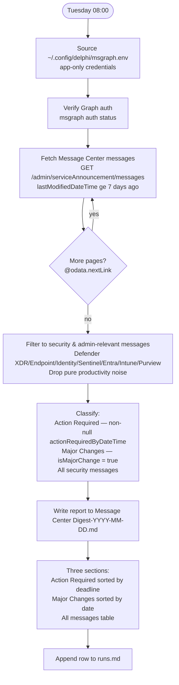

# Message Center Digest

**Cadence:** Monthly — 1st of month at 06:00 Stockholm  
**Cron:** `0 4 1 * *` (04:00 UTC)  
**Output:** `Message Center Digest-YYYY-MM-DD.md`  
**Status:** Active — remote routine

## Description

Monthly digest of Microsoft 365 Message Center security & compliance items for the previous calendar month. Sources from the public mc.merill.net aggregator via WebFetch and targeted web_search (site:mc.merill.net). Produces a sorted table of all in-scope items with Action Required deadlines highlighted.

## Filter

Microsoft Purview, Defender XDR, Defender for Office 365, Microsoft Entra, Intune, Microsoft Edge (security/MAM only), Exchange Online (DLP/transport/certs only), Teams (sensitivity labels, encryption, external auth only), Microsoft 365 suite (platform security items only). Drops productivity-only noise.

## Process

## Prompt

Produce a monthly Microsoft 365 Message Center digest focused on **security & compliance** for the calendar month that just ended (i.e. when this runs on the 1st of month M, report on month M-1). Use Europe/Berlin local time to determine the reporting month and the run date.

### Agent Grounding

Use these sources as tools for this job:
- Agent guide: https://mc.merill.net/llms.txt
- Search index: https://mc.merill.net/messages-index.json
- RSS feed: https://mc.merill.net/rss.xml

### Data sources

1. Fetch the homepage `https://mc.merill.net/` with web_fetch — it lists the most recent ~150 items with Published / Last Updated dates.
2. For coverage of items earlier in the month than the homepage shows, use parallel `web_search` calls with the `site:mc.merill.net` operator, e.g. `site:mc.merill.net Microsoft Purview April 2026`, `site:mc.merill.net "Defender for Office 365" April 2026`, `site:mc.merill.net Microsoft Entra April 2026`, `site:mc.merill.net Microsoft Intune April 2026`, `site:mc.merill.net Microsoft Edge security April 2026`, `site:mc.merill.net sensitivity label April 2026`. Per-item URL pattern is `https://mc.merill.net/message/<ID>` (works for both MC and RM IDs).
3. NOTE: web_fetch does NOT work on `messages-index.json`, `llms.txt`, service-specific archive pages, or pagination URLs. Use the homepage + web_search-with-site-operator approach.

### Filter (focus = security & compliance)

Include items where the **primary impact** is security, identity, data protection, threat protection, compliance, or endpoint security. Tracked services: Microsoft Purview, Microsoft Defender XDR, Microsoft Defender for Office 365, Microsoft Entra, Microsoft Intune, Microsoft Edge (security/MAM features only), Exchange Online (only sec/compliance items like DLP, transport security, certs), Microsoft Teams (only sec/compliance items: sensitivity-label inheritance, encryption, external-presenter auth, download controls), Microsoft 365 suite (only platform-security items: cert distrust, Secure Boot, Conditional Access, Autopatch security defaults). Drop productivity-only items (meeting UX, reactions, Loop social features, mobile RSVP polish, etc.).

Include items where the published date OR a material rollout milestone (GA, preview, opt-out availability, enforcement start) falls inside the reporting month.

### Per-item fields

- **Date**: YYYY-MM-DD — published date if in-month, otherwise the in-month milestone date.
- **Title**: short human-readable feature name (4–10 words). Strip leading "Microsoft <service>:" prefix.
- **Service**: e.g. Microsoft Purview, Microsoft Defender XDR, Microsoft Entra, Microsoft Intune, Microsoft Edge, Microsoft 365 suite.
- **Category**: pick one — Data Protection & Compliance, Identity & Access, Email Security, Endpoint Security, Threat Protection, Platform Security.
- **Type**: GA, Public Preview, Update, Rollout, Retirement, Action Required, Plan for Change.
- **Summary**: 1–2 sentences focused on what changes for admins/users, including default state and key dates.
- **Link**: for MC IDs `https://admin.microsoft.com/Adminportal/Home#/MessageCenter/:/messages/<MCID>`; for RM IDs `https://www.microsoft.com/en-us/microsoft-365/roadmap?id=<numeric>`. Anchor text = the ID itself. Never fabricate IDs.

### Output file

Save the report as `Message Center Digest-YYYY-MM-DD.md` where the date is today's run date.
