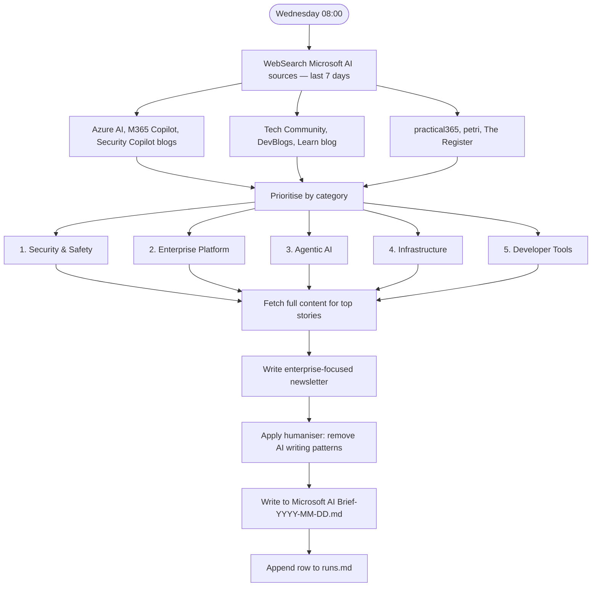

# Microsoft AI Brief

**Cadence:** Weekly — every Wednesday at 09:00 Stockholm  
**Cron:** `0 7 * * 3` (07:00 UTC)  
**Output:** `Microsoft AI Brief-YYYY-MM-DD.md`  
**Status:** Active — remote routine

## Description

Weekly newsletter covering Microsoft AI developments from the past 7 days, focused on enterprise-relevant updates across Azure AI, M365 Copilot, Security Copilot, and the Microsoft developer ecosystem. Prioritises by category and applies humanised prose to the final output.

## Priority categories

1. Security & Safety
2. Enterprise Platform
3. Agentic AI
4. Infrastructure
5. Developer Tools

## Sources

Azure AI blog, M365 Copilot blog, Security Copilot blog, Microsoft Tech Community, DevBlogs, Learn blog, practical365, petri, The Register

## Process

## Prompt

You are producing the weekly Microsoft AI Brief — an enterprise-focused newsletter covering Microsoft AI developments from the past 7 days.

First, run `date` to get today's date. Use Europe/Berlin timezone. The report covers the 7 days ending today.

Step 1 — Parallel web searches across Microsoft AI sources (last 7 days):
- Azure AI blog: site:techcommunity.microsoft.com "Azure AI" OR "Azure OpenAI"
- M365 Copilot: site:techcommunity.microsoft.com "Microsoft 365 Copilot"
- Security Copilot: site:techcommunity.microsoft.com "Security Copilot"
- Microsoft DevBlogs AI: site:devblogs.microsoft.com AI agent

Step 2 — Prioritise stories in this category order: 1) Security & Safety, 2) Enterprise Platform, 3) Agentic AI, 4) Infrastructure, 5) Developer Tools.

Step 3 — Fetch full content for the top 5–7 stories.

Step 4 — Write an enterprise-focused newsletter. For each story: what changed, what it means for enterprise IT/security teams, any action required or date to watch. Organise by priority category.

Step 5 — Apply humaniser: remove AI writing patterns. Avoid: "delve", "it's worth noting", em-dash overuse, numbered lists where prose is more natural.
