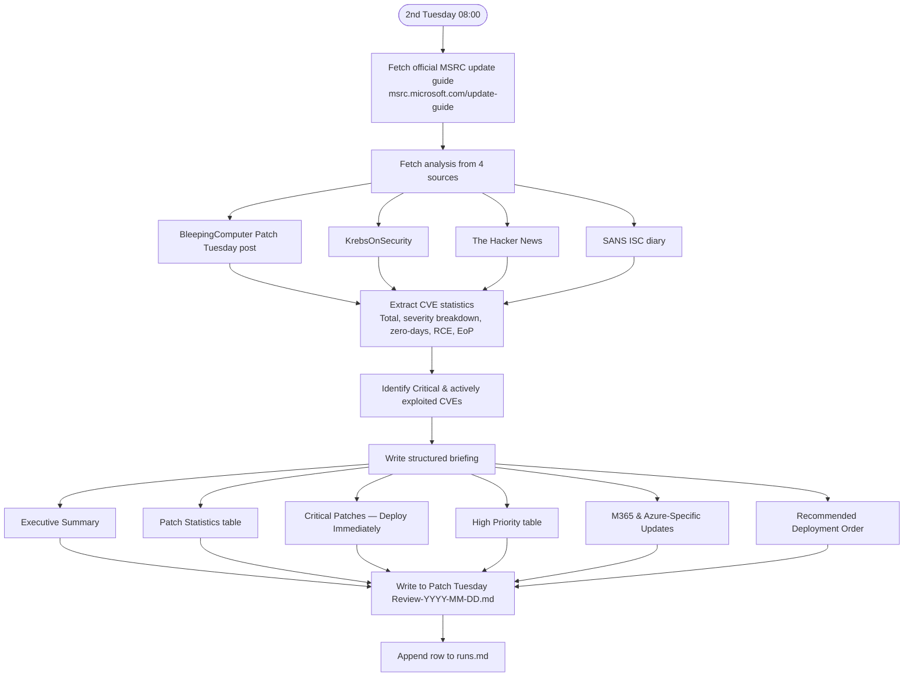

# Patch Tuesday Review

**Cadence:** Monthly — 2nd Tuesday at 08:00 Stockholm  
**Cron:** `0 6 8-14 * 2` (06:00 UTC, fires on Tuesdays between 8th–14th)  
**Output:** `Patch Tuesday Review-YYYY-MM-DD.md`  
**Status:** Active — remote routine

## Description

Monthly structured review of Microsoft's Patch Tuesday release. Gathers CVE statistics from MSRC and four security analysis sources, identifies critical and actively exploited vulnerabilities, and delivers a prioritised briefing for security teams and system administrators.

## Sections

- Executive Summary (total CVEs, zero-days, critical count)
- Breakdown by type (table)
- Exploited in the Wild (table)
- Publicly Disclosed (table)
- Highest Rated — CVSS ≥ 8.0 or Critical (table)
- Exploitation More Likely
- Notable themes from this month
- Sources

## Sources

MSRC update guide, BleepingComputer, KrebsOnSecurity, The Hacker News, SANS ISC diary

## Process

## Prompt

Generate the monthly Microsoft Patch Tuesday review for the current month and deliver it to Simon.

1. The "patch month" — typically the current calendar month, since Patch Tuesday falls on the 2nd Tuesday.

2. Gather data via parallel web_search queries (the MSRC CVRF API is not reachable from this sandbox). Issue these in parallel, substituting the current month and year:
   - "Microsoft Patch Tuesday {Month} {Year} summary total CVEs zero-day"
   - "Microsoft Patch Tuesday {Month} {Year} critical RCE CVE list"
   - "Microsoft Patch Tuesday {Month} {Year} exploited in the wild publicly disclosed"
   - "Microsoft Patch Tuesday {Month} {Year} BleepingComputer Qualys CrowdStrike breakdown by type"
   - "CISA KEV {Month} {Year} Microsoft CVE deadline"
   Pull from BleepingComputer, CrowdStrike, Qualys, Absolute Security, The Hacker News, Tenable, Rapid7, MSRC release notes when surfaced. Cross-reference at least two sources for every CVE listed.

3. Synthesize into the structured report. Required sections, in order:
   - Title: "# Microsoft Patch Tuesday Review — {Month} {Year}"
   - "_Generated {YYYY-MM-DD}_" (no caveats, no dry-run banners)
   - "## Summary" with bullets: total CVEs patched, zero-days (exploited + publicly disclosed), critical-severity count, Edge/Chromium count if separately released
   - "### Breakdown by type" markdown table: Elevation of Privilege, Remote Code Execution, Information Disclosure, Security Feature Bypass, Denial of Service, Spoofing, Edge–Chromium
   - "## Exploited in the Wild" table: CVE | CVSS | Criticality (Critical/Important/Moderate/Low) | Title | Customer Action | Link. Use [FIXED] in the Customer Action column when the patch is auto-installed; otherwise "Required".
   - "## Publicly Disclosed" table: same columns
   - "## Highest Rated — CVSS ≥ 8.0 or Critical" table: same columns. Include any CVE with CVSS ≥ 8.0 OR labeled Critical by Microsoft, even if CVSS isn't published.
   - "## Exploitation More Likely" — list CVEs Microsoft tagged with this exploitability assessment when sources name them; otherwise note that secondary sources don't enumerate them all.
   - "## Notable themes from this month" — 3–5 bullets covering attack surface patterns, infrastructure exposure, attack-chain compositions
   - "---"
   - "## Sources" — bulleted list of every source URL consulted, formatted as `[Publisher — Article title](URL)`. Include the MSRC release-notes link as the last source.
   For any CVE where CVSS or criticality could not be confirmed, write "n/a" in that column. Never fabricate a value.

4. FINAL SUMMARY (chat): one or two sentences naming the patch month, total CVE count, zero-day count.

### Output file

Save the report as `Patch Tuesday Review-YYYY-MM-DD.md` where the date is today's run date.
