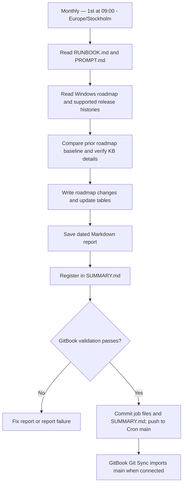

---
layout:
  width: wide
---

# Windows Monthly Brief

Windows-roadmap och föregående månads säkerhets- och previewuppdateringar.

**Codex-jobb:** `Cron - Windows Monthly Brief`  
**Modell:** Luna 6.0 (`gpt-6-luna`), medium reasoning  
**Schema:** Monthly — 1st at 09:00, `Europe/Stockholm`  
**Rapport:** `Windows Monthly Brief-YYYY-MM-DD.md`

- [Prompt](PROMPT.md)
- [Exempel](EXAMPLES.md)
- [Gemensamma körinstruktioner](../RUNBOOK.md)
- [Mermaid-källfil](diagram.mmd)

## Process

